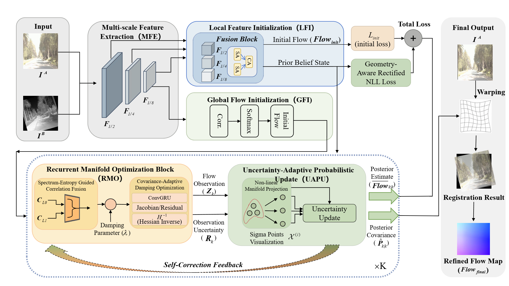

# RBE-Flow (ECCV 2026)

Official implementation of

> **RBE-Flow: Recurrent Bayesian Estimation on Feature Manifolds for Cross-Modal Registration**  
> European Conference on Computer Vision (ECCV), 2026

---

## Authors

**Mengzhu Ding, Xin Song, Xiaoke Ding, Hongwei Ding, Xuecong Liu**

School of Computer and Communication Engineering, Northeastern University at Qinhuangdao

---

## Resources

- **Project Page:** https://github.com/NEU-Liuxuecong/RBE-Flow
- **Paper:** https://arxiv.org/abs/2606.30492
- **Pretrained Weights:** See the *Pretrained Models* section below.

---

## Overview

RBE-Flow is a recurrent Bayesian feature-flow estimation framework for cross-modal image registration. The proposed method formulates feature flow estimation as a recursive Bayesian inference process on feature manifolds, enabling reliable correspondence estimation under severe modality discrepancies and geometric transformations.

<p align="center">
  
</p>

---

## Data Preparation

To facilitate reproducible evaluation, we release the benchmark test datasets used in the ECCV 2026 paper.

### Released Test Datasets

* [OSdataset (Test Set)](https://pan.baidu.com/s/1hnOdeHOop2dopEtwm234KA) (Code: `X3N6`)
* [RoadScene (Test Set)](https://pan.baidu.com/s/1-Aencnz5GXsQtuT_KXSkbg) (Code: `C8qs`)
* [WHU-OPT-SAR (Test Set)](https://pan.baidu.com/s/1R8RAtC5gNq5diXddZg7WCg) (Code: `Te9n`)

---

The released datasets should be organized as follows:

```text
datasets
├── os_dataset
│   └── test
│       ├── image_pair
│       ├── truth_flow
│       └── datum
│
├── RoadScene
│   └── test
│       ├── image_pair
│       ├── truth_flow
│       └── datum
│
└── WHU
    └── test
        ├── image_pair
        ├── truth_flow
        └── datum
```

## Requirements
```shell
conda create --name RBE-Flow python=3.9.7
conda activate crft
conda install pytorch=2.3.1 torchvision=0.18.1 pytorch-cuda=12.1 matplotlib tensorboard scipy opencv -c pytorch -c nvidia
pip install opencv-python==4.8.0.76
pip install numpy==1.26.4
pip install pytorch-lightning loguru joblib tqdm h5py einops
```

## Training
```shell
python train.py
```

## Models
We provide models trained on OSdataset and RoadScene respectively. The default path of the models for evaluation is:
```Shell
├── checkpoints
    ├── OS_15trans0.1scale30rot.ckpt
    ├── RS_15trans0.1scale30rot.ckpt 
    ├── WHU_15trans0.1scale30rot.ckpt 
```


## Test
```Shell
python test.py 
```


## Citation
```bibtex
@article{ding2026rbe,
  title={RBE-Flow: Recurrent Bayesian Estimation on Feature Manifolds for Cross-Modal Registration},
  author={Ding, Mengzhu and Song, Xin and Ding, Xiaoke and Ding, Hongwei and Liu, Xuecong},
  journal={arXiv preprint arXiv:2606.30492},
  year={2026}
}
```
